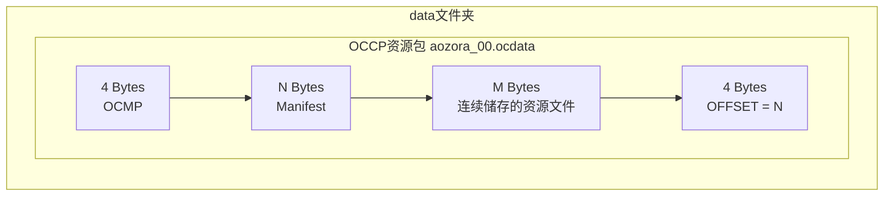
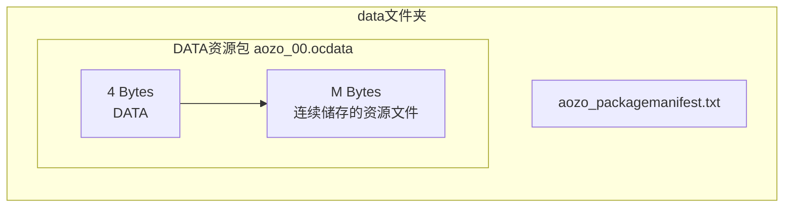

# PackageSystem

## Package 结构

Package分为两种，一种是携带了packagemanifest的最终发布用资源包（其魔数为OCCP，OpenCore Combination Package），另一种为外置packagemanifest的中间资源包（魔数为DATA）

### OCCP 包 : OpenCore Combination Package 包

携带这个魔数的包需要经过引擎的提取，将清单文件提取出来后，才方便使用。

### DATA 包 : OpenCore Database 包

携带这个魔数的包是已经经过提取、可以直接使用的包